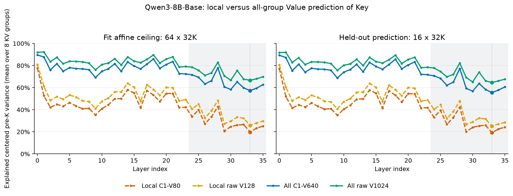

# Qwen3-8B: Four Value-to-Pre-Key Affine Ceilings

All 36 layers completed. The all-group control changes the interpretation of the earlier local-group result: substantial Key variance is linearly predictable from other Value groups, including their existing C1 latents.



Vector exports: [SVG](four_ceilings.svg), [PDF](four_ceilings.pdf). Exact values: [CSV](ceilings.csv), [aggregate JSON](aggregate.json).

## Protocol and metric

Qwen3-8B-Base; all 36 layers; 8 KV groups per layer. The regression fit uses 64 C4 windows of 32,768 tokens; evaluation uses the same 16 separate 32,768-token windows as the local controls. The C1-V80 checkpoint is fixed. All-group activation rows are concatenated across groups at the same token position. No neighboring token, future token, Query, or Key is used as an input feature.

Inputs are local C1-V80, local raw V128, all C1-V640, and all raw V1024. Each target is that layer's per-group pre-RoPE K128. Each predictor is an unrestricted affine map, without a Base16/24 rank constraint. Existing activation captures are streamed; this experiment performs no model forward.

For centered fit activations, $\eta_g=1-\mathrm{tr}(G_{KK,g}-G_{KX,g}G_{XX}^{\dagger}G_{XK,g})/\mathrm{tr}(G_{KK,g})$. Held-out values are $R_g^2=1-\|K_g-\widehat K_g\|_F^2/\|K_g-\overline K_{g,\mathrm{heldout}}\|_F^2$, using the fit-split map and bias without refitting. Layer values are arithmetic means over the 8 group-specific ratios, not one ratio of pooled energies. Cohort means weight layers equally.

## Representative held-out results

| Layer | Local C1-V80 | Local raw V128 | All C1-V640 | All raw V1024 |
|---:|---:|---:|---:|---:|
| 0 | 77.209% | 80.602% | 89.338% | 91.776% |
| 13 | 49.909% | 56.038% | 74.436% | 80.007% |
| 29 | 20.001% | 26.660% | 59.380% | 69.177% |
| 33 | 19.100% | 25.046% | 55.522% | 64.656% |
| 35 | 24.143% | 28.489% | 60.636% | 67.666% |

## Depth averages

| Layers | Split | Local C1-V80 | Local raw V128 | All C1-V640 | All raw V1024 |
|:---|:---|---:|---:|---:|---:|
| 0--11 | fit | 46.082% | 52.607% | 78.291% | 84.111% |
| 0--11 | heldout | 45.647% | 52.196% | 77.757% | 83.617% |
| 12--23 | fit | 50.545% | 56.308% | 79.228% | 84.185% |
| 12--23 | heldout | 50.259% | 56.039% | 78.788% | 83.729% |
| 24--35 | fit | 28.606% | 34.325% | 64.343% | 72.212% |
| 24--35 | heldout | 27.973% | 33.619% | 62.974% | 70.780% |
| All | fit | 41.744% | 47.746% | 73.954% | 80.170% |
| All | heldout | 41.293% | 47.285% | 73.173% | 79.376% |

## Layer 33 decomposition and interpretation

The local raw-V fit ceiling is 25.78%, while the all-raw-V ceiling is 66.63%. Access to the other groups therefore adds 40.85 percentage points. Held-out prediction shows the same effect: 25.05% to 64.66%.

Local C1-V80 explains 19.72% in fit; all C1-V640 explains 57.31%. Their held-out values are 19.10% and 55.52%. This establishes a substantial cross-group linear prediction opportunity within the existing C1 features.

Along the nested fit spaces $C_g\subseteq C_{\mathrm{all}}\subseteq V_{\mathrm{all}}$, centered Key energy admits the following normalized projection partition:

| Component | Fraction of centered K energy, mean over groups |
|:---|---:|
| Predictable from local C1 | 19.723% |
| Additional prediction from other C1 groups | 37.586% |
| Predictable from all raw V but lost by all C1 | 9.318% |
| Unexplained by all raw V under affine prediction | 33.373% |

The earlier statement that most layer-33 Key variance is absent from Values was too broad: the approximately 74% unexplained local-raw-V fraction included variance recoverable from other groups. The all-raw-V fit residual is approximately 33%, not 74%. This is a correction to the interpretation; the previous local measurements remain valid.

Both effects coexist. Cross-group access produces a large gain, but all-raw-V held-out explained variance still falls from about 84% in layers 0--23 to about 71% in layers 24--35. The results support a combination of group locality limits and a remaining late-layer affine residual; they do not establish statistical independence or a literal movement of information between groups.

All-C1 held-out prediction exceeds local-raw-V prediction in all 36 layers. These are unrestricted reconstruction results. They do not measure query-weighted error, page recall, PPL, RULER accuracy, or decode speed. They also do not establish that a low-rank cross-group router attains this ceiling. Reusing resident C1 features avoids new per-token inputs, but cross-group computation and tensor-parallel communication costs remain unmeasured.

## Complete per-layer fit results

| Layer | Local C1-V80 | Local raw V128 | All C1-V640 | All raw V1024 |
|---:|---:|---:|---:|---:|
| 0 | 77.599% | 80.837% | 89.572% | 91.994% |
| 1 | 52.646% | 61.151% | 87.760% | 92.294% |
| 2 | 42.123% | 48.592% | 75.961% | 83.547% |
| 3 | 44.812% | 51.813% | 81.661% | 87.427% |
| 4 | 43.152% | 49.500% | 74.843% | 81.686% |
| 5 | 46.470% | 53.369% | 78.138% | 83.865% |
| 6 | 43.363% | 51.430% | 77.310% | 83.772% |
| 7 | 40.856% | 48.026% | 77.032% | 83.326% |
| 8 | 41.249% | 47.417% | 76.206% | 82.161% |
| 9 | 35.246% | 41.043% | 69.145% | 76.121% |
| 10 | 41.011% | 47.664% | 74.766% | 80.939% |
| 11 | 44.460% | 50.439% | 77.102% | 82.207% |
| 12 | 49.928% | 56.146% | 81.571% | 86.150% |
| 13 | 50.102% | 56.241% | 74.917% | 80.563% |
| 14 | 58.014% | 64.001% | 83.214% | 87.755% |
| 15 | 55.123% | 60.397% | 79.570% | 84.019% |
| 16 | 41.717% | 47.671% | 77.045% | 82.686% |
| 17 | 57.345% | 62.564% | 81.291% | 85.606% |
| 18 | 53.252% | 58.239% | 85.932% | 89.624% |
| 19 | 47.411% | 53.070% | 77.482% | 82.314% |
| 20 | 54.731% | 60.231% | 80.975% | 85.928% |
| 21 | 54.667% | 59.789% | 83.616% | 87.776% |
| 22 | 41.919% | 48.049% | 72.740% | 78.685% |
| 23 | 42.333% | 49.292% | 72.384% | 79.113% |
| 24 | 33.705% | 40.790% | 71.610% | 78.613% |
| 25 | 39.917% | 45.072% | 69.392% | 75.651% |
| 26 | 27.249% | 32.565% | 63.324% | 71.048% |
| 27 | 33.503% | 38.989% | 66.228% | 73.315% |
| 28 | 42.736% | 48.395% | 77.978% | 82.904% |
| 29 | 20.595% | 27.312% | 60.778% | 70.627% |
| 30 | 24.741% | 29.739% | 58.287% | 66.732% |
| 31 | 26.069% | 33.236% | 65.190% | 75.420% |
| 32 | 26.579% | 32.308% | 59.811% | 67.766% |
| 33 | 19.723% | 25.779% | 57.309% | 66.627% |
| 34 | 23.309% | 28.007% | 59.514% | 68.028% |
| 35 | 25.142% | 29.707% | 62.691% | 69.816% |

## Complete per-layer held-out results

| Layer | Local C1-V80 | Local raw V128 | All C1-V640 | All raw V1024 |
|---:|---:|---:|---:|---:|
| 0 | 77.209% | 80.602% | 89.338% | 91.776% |
| 1 | 52.031% | 60.532% | 87.280% | 91.947% |
| 2 | 41.548% | 48.015% | 75.316% | 82.953% |
| 3 | 44.320% | 51.299% | 81.169% | 86.978% |
| 4 | 42.471% | 48.856% | 74.060% | 80.975% |
| 5 | 46.102% | 53.006% | 77.557% | 83.314% |
| 6 | 43.042% | 51.141% | 76.774% | 83.261% |
| 7 | 40.579% | 47.740% | 76.637% | 82.957% |
| 8 | 40.949% | 47.104% | 75.758% | 81.753% |
| 9 | 34.965% | 40.811% | 68.750% | 75.714% |
| 10 | 40.517% | 47.235% | 74.022% | 80.266% |
| 11 | 44.026% | 50.008% | 76.425% | 81.508% |
| 12 | 49.461% | 55.760% | 81.063% | 85.640% |
| 13 | 49.909% | 56.038% | 74.436% | 80.007% |
| 14 | 57.770% | 63.803% | 82.844% | 87.373% |
| 15 | 54.954% | 60.220% | 79.216% | 83.620% |
| 16 | 41.410% | 47.413% | 76.590% | 82.224% |
| 17 | 57.041% | 62.309% | 80.921% | 85.208% |
| 18 | 53.140% | 58.151% | 85.696% | 89.375% |
| 19 | 47.125% | 52.772% | 77.024% | 81.851% |
| 20 | 54.552% | 60.064% | 80.565% | 85.514% |
| 21 | 54.397% | 59.502% | 83.263% | 87.424% |
| 22 | 41.468% | 47.608% | 72.114% | 78.062% |
| 23 | 41.879% | 48.833% | 71.723% | 78.456% |
| 24 | 33.155% | 40.285% | 70.700% | 77.779% |
| 25 | 39.450% | 44.573% | 68.409% | 74.621% |
| 26 | 26.707% | 32.001% | 62.109% | 69.775% |
| 27 | 32.947% | 38.409% | 64.985% | 72.035% |
| 28 | 42.324% | 47.949% | 77.324% | 82.223% |
| 29 | 20.001% | 26.660% | 59.380% | 69.177% |
| 30 | 24.017% | 28.886% | 56.775% | 65.167% |
| 31 | 25.371% | 32.481% | 63.729% | 74.036% |
| 32 | 25.927% | 31.570% | 58.324% | 66.128% |
| 33 | 19.100% | 25.046% | 55.522% | 64.656% |
| 34 | 22.531% | 27.077% | 57.799% | 66.100% |
| 35 | 24.143% | 28.489% | 60.636% | 67.666% |

## Verification and execution

All shard protocols match, all 36 layers are present once, all metrics are finite, and the expected nested-space inequalities hold per KV group. The maximum relative difference in target centered energy between new and reused raw-V controls is 1.16e-14. All-group input Grams reported full numerical rank (640 and 1024).

The fit script uses FP32 products with TF32 disabled, accumulated into FP64 Grams; the centered covariance pseudoinverse is computed in FP64. The reused local control uses the same capture discovery and dimensions. The largest all-raw-V fit-to-held-out difference is 2.151 percentage points.

Slurm array 8300105: four NVIDIA L40S GPUs, one per shard, 2 CPU threads and 40 GiB host allocation per shard. All tasks completed with exit code 0 in 6:00--6:03. Reported MaxRSS: 36.55--37.46 GiB. GPU experiments used `/home/zhangal/.conda/envs/basis/bin/python`, PyTorch 2.6.0+cu124. Stderr contains only the Transformers RoPE `device` deprecation warning.

The synthetic cross-group test passed before submission: targets generated from another Value group are recovered with essentially zero held-out error. The aggregation checks above additionally validate the completed experiment outputs.

Exact GPU script commands and Python executable paths are retained in each [shard result](shard_0/result.json) and in the `sources` field of [aggregate.json](aggregate.json); the latter includes source SHA-256 hashes. Only `--shard-index` and the shard output suffix differ across the four commands.

Summary and plot command:

```bash
/home/zhangal/.conda/envs/basis/bin/python /deac/csc/yangGrp/zhangal/BasisServe-CALS/evaluation/summarize_qwen3_8b_four_v_pre_k_ceilings.py --root /deac/csc/yangGrp/zhangal/BasisServe-CALS/results/evaluation/qwen3_8b_four_v_pre_k_ceilings_64f16h_32k
```

Plotting uses Matplotlib from an isolated temporary dependency directory; the shared conda environments are not modified.
