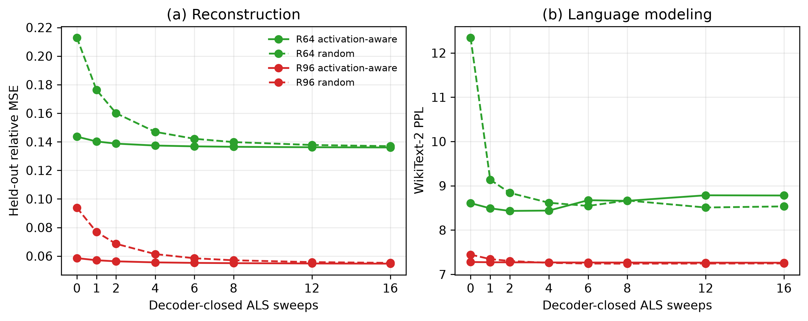
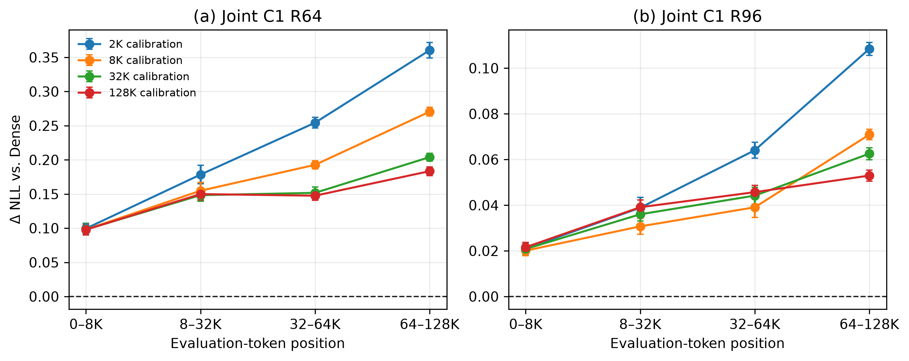
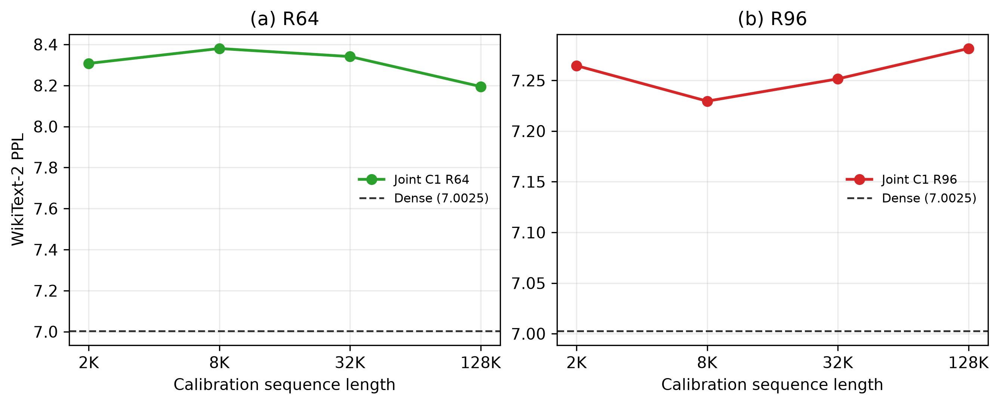

# Section 3 Appendix Ablations — Complete Results

## Executive summary

This appendix isolates Value compression and joint output fitting. Dense K,
full dense attention, and the same model revision are used throughout. No
Section 4 routing, K offload, sparse selection, Page-Fisher, sink/recent rule,
or rank allocator is present.

The completed results support four conclusions:

1. C1 remains effective when calibrated on WikiText-2 rather than C4. At R96,
   WikiText-2-calibrated C1 reaches PPL `7.1181` and seven-task MCQ `0.69535`,
   compared with Dense `7.0025` and `0.70430`.
2. Activation-aware initialization is substantially better at sweep 0, but
   random orthogonal initialization largely catches reconstruction after many
   ALS sweeps. Reconstruction convergence is monotone; downstream PPL and MCQ
   are not necessarily monotone in the number of sweeps.
3. With the total calibration-token budget fixed, longer calibration sequences
   reduce 128K degradation, especially at R64 and at late token positions.
4. At matched retained Value rank, Joint C1 outperforms activation-aware
   per-KV-group SVD in complete-layer reconstruction, WikiText-2 PPL, and MCQ.

The logical progression is therefore:

> standard calibration → optimizer stability → long-context calibration →
> joint-objective value

## Executed scope

The prose proposal mentioned Llama-3.1-8B Base and ranks R64/R80/R96. The
formal experiment matrix was subsequently locked to the already requested and
prepared configuration below. This report describes the executed experiments
and does not relabel Qwen results as Llama results.

| Item | Executed setting |
|---|---|
| Model | `Qwen/Qwen3-8B-Base` |
| Revision | `49e3418fbbbca6ecbdf9608b4d22e5a407081db4` |
| Config SHA-256 | `3bd01d7ad7a2e203ecbbe84e24087a51c6d2a108ee4bcc42d0016bf49564983a` |
| Formal ranks | R64 and R96 per physical KV head |
| Compression | Value only |
| K / attention | Exact Dense K / full dense attention |
| C1 production fit | Activation-weighted initialization, six encoder sweeps, final exact decoder refit |
| ALS diagnostic | Activation-aware versus random-orthogonal initialization, through S16 |
| Group baseline | Activation-aware per-KV-group truncated SVD; no group-local ALS |
| Environment | `basis`; BF16 model/factors; FP32 covariance and loss accumulation |
| TF32 | Disabled |

R80 is not included because the final formal matrix was narrowed to R64/R96.
The ALS diagnostic includes the locked production S6 point explicitly, while
S12 and S16 extend the originally proposed S0/S1/S2/S4/S8 convergence check.
Group-SVD MCQ was inexpensive enough to report at both ranks rather than only
R96.

## Common protocol

- C1 minimizes the complete attention-layer output objective and permits
  cross-head covariance through the joint fit.
- Every reported ALS checkpoint is decoder closed: S0 is the initialization
  followed by an exact decoder refit; every later endpoint is exported only
  after the same decoder refit.
- C1 uses covariance ridge `1e-5`, fixed 16-iteration CG, recorded relative
  tolerance `1e-8`, and no early stopping. There is no encoder damping,
  decoder jitter, or backtracking hyperparameter.
- The fixed-CG policy intentionally reaches 16 iterations for every solve. At
  S16, each rank/initialization condition records 4,608 solves, mean/max
  iterations `16/16`, cap-hit fraction `1.0`, and zero tolerance-triggered
  early convergence. This is the chosen fixed compute budget, not a failure.
- S6 was reproduced separately because its factors were not retained by the
  original S16 export. All 6,048 recorded S0--S6 trajectory scalars across 36
  layers and four conditions exactly match the original run (maximum absolute
  difference `0.0`), so S6 lies on the same deterministic optimization path.
- WikiText-2 PPL uses batch size 2. The seven MCQ tasks use lm-eval batch size
  8: ARC-Easy, ARC-Challenge, HellaSwag, PIQA, WinoGrande, BoolQ, and
  OpenBookQA.
- All formal GPU evaluations used NVIDIA L40S. The memory-heavy 128K
  covariance capture alone used one H200.

## 1. WikiText-2 calibration

### Question

Does C1 continue to work when the calibration corpus is WikiText-2 rather than
the standard C4 calibration snapshot?

### Data and fitting

- Fit: 128 disjoint WikiText-2 train windows × 2048 tokens = 262,144 tokens.
- Held-out fit diagnostic: 32 disjoint validation windows × 2048 tokens =
  65,536 tokens.
- Evaluation: WikiText-2 test PPL plus the same seven-task MCQ suite.
- C1: activation-weighted initialization, six encoder sweeps, final decoder
  refit.
- PaLU: activation-whitened SVD with uniform matched rank. M-LRD has one
  physical KV head per group; G4-LRD uses group rank `4r`, namely 256 at R64
  and 384 at R96. Fisher rank allocation is disabled in this ablation.

### Results

| Method | R64 PPL ↓ | R64 MCQ ↑ | R96 PPL ↓ | R96 MCQ ↑ |
|---|---:|---:|---:|---:|
| Dense | 7.0025 | 0.70430 | 7.0025 | 0.70430 |
| Joint C1 | **7.6590** | **0.64672** | **7.1181** | **0.69535** |
| PaLU M-LRD | 10.9782 | 0.54263 | 9.0649 | 0.64734 |
| PaLU G4-LRD | 9.9710 | 0.62343 | 9.0087 | 0.68137 |

At R96, C1 is within `0.1156` PPL and `0.00895` absolute MCQ of Dense. It is
also the strongest compressed method at both ranks. This supports the intended
corpus-robustness claim: C1 does not require a special C4-only calibration
path to outperform the matched PaLU baselines.

The result does not claim corpus invariance in general; it establishes the
claim for the locked C4 and WikiText-2 protocols used here.

## 2. ALS sweeps and initialization

### Question

How quickly does the solver converge, and how strongly does it depend on
initialization?

Activation-aware initialization is compared with a random orthogonal
initialization using seed 73. All endpoints use the same exact decoder closure.
S6 is the fixed production compute point and is reported explicitly; it was
not chosen using appendix test PPL. S12/S16 are retained as an extended
convergence check.

### R64

| Initialization | Sweep | Held-out rel-MSE ↓ | WT2 PPL ↓ | MCQ average ↑ |
|---|---:|---:|---:|---:|
| Activation-aware | 0 | 0.14358 | 8.6086 | 0.66208 |
| Activation-aware | 1 | 0.14026 | 8.4913 | — |
| Activation-aware | 2 | 0.13872 | **8.4330** | 0.66404 |
| Activation-aware | 4 | 0.13738 | 8.4408 | 0.66371 |
| Activation-aware | 6 | 0.13681 | 8.6747 | 0.66682 |
| Activation-aware | 8 | 0.13650 | 8.6608 | 0.66621 |
| Activation-aware | 12 | 0.13618 | 8.7857 | 0.66784 |
| Activation-aware | 16 | **0.13602** | 8.7812 | 0.66886 |
| Random orthogonal | 0 | 0.21281 | 12.3422 | 0.63193 |
| Random orthogonal | 1 | 0.17624 | 9.1380 | — |
| Random orthogonal | 2 | 0.16000 | 8.8411 | 0.66445 |
| Random orthogonal | 4 | 0.14695 | 8.6169 | 0.66717 |
| Random orthogonal | 6 | 0.14209 | 8.5458 | 0.66939 |
| Random orthogonal | 8 | 0.13980 | 8.6687 | 0.67143 |
| Random orthogonal | 12 | 0.13777 | **8.5101** | 0.67070 |
| Random orthogonal | 16 | **0.13693** | 8.5352 | **0.67364** |

### R96

| Initialization | Sweep | Held-out rel-MSE ↓ | WT2 PPL ↓ | MCQ average ↑ |
|---|---:|---:|---:|---:|
| Activation-aware | 0 | 0.05855 | 7.2791 | 0.69570 |
| Activation-aware | 1 | 0.05707 | 7.2738 | — |
| Activation-aware | 2 | 0.05631 | 7.2717 | 0.69517 |
| Activation-aware | 4 | 0.05558 | 7.2694 | **0.69745** |
| Activation-aware | 6 | 0.05523 | 7.2679 | 0.69615 |
| Activation-aware | 8 | 0.05502 | 7.2673 | 0.69570 |
| Activation-aware | 12 | 0.05481 | 7.2646 | 0.69475 |
| Activation-aware | 16 | **0.05469** | **7.2632** | 0.69477 |
| Random orthogonal | 0 | 0.09382 | 7.4460 | 0.68248 |
| Random orthogonal | 1 | 0.07683 | 7.3453 | — |
| Random orthogonal | 2 | 0.06858 | 7.3025 | 0.69009 |
| Random orthogonal | 4 | 0.06137 | 7.2595 | 0.69000 |
| Random orthogonal | 6 | 0.05847 | 7.2450 | 0.68970 |
| Random orthogonal | 8 | 0.05705 | **7.2422** | 0.69228 |
| Random orthogonal | 12 | 0.05576 | 7.2450 | 0.69208 |
| Random orthogonal | 16 | **0.05523** | 7.2470 | **0.69237** |



### Interpretation

- Activation-aware initialization provides a large head start, especially at
  R64: its S0 held-out error is `0.14358`, versus random `0.21281`.
- Random initialization largely catches reconstruction by S16, although a
  small gap remains at both ranks.
- Held-out reconstruction improves monotonically with sweeps, but downstream
  quality does not. R64 activation-aware PPL is best at S2, whereas its
  reconstruction continues to improve through S16. R96 random PPL is best at
  S8 and then changes little.
- The production S6 point makes the selection rule explicit. For
  activation-aware initialization it yields PPL/MCQ `8.6747/0.66682` at R64
  and `7.2679/0.69615` at R96. It is a fixed compute endpoint rather than the
  downstream-best checkpoint from this diagnostic.
- Therefore, the solver converges predictably in its fitted objective, while
  downstream metrics should not be used as evidence that more ALS sweeps are
  always better.

## 3. Long-context calibration

### Question

With total calibration tokens held fixed, does C1 benefit from longer
calibration sequences when evaluated at 128K context?

### Calibration and evaluation

Every condition has exactly 1,048,576 fit tokens, approximately 1M rather than
11M:

| Calibration length | Fit windows | Fit tokens | Held-out windows | Held-out tokens |
|---:|---:|---:|---:|---:|
| 2K | 512 | 1,048,576 | 128 | 262,144 |
| 8K | 128 | 1,048,576 | 32 | 262,144 |
| 32K | 32 | 1,048,576 | 8 | 262,144 |
| 128K | 8 | 1,048,576 | 2 | 262,144 |

The C4 windows are document-disjoint across fit, held-out, and evaluation
partitions. Evaluation uses the same eight 128K sequences for every condition,
for 1,048,576 evaluation tokens per condition. Qwen3-8B-Base is native 32K, so
Dense and every compressed condition use identical static YaRN factor 4.
Likelihood is evaluated in 128-token execution chunks with Dense K and full
dense attention; chunking does not change the likelihood definition.

Dense overall PPL is `10.8622`. Its position-bucket PPL values are `7.8541`,
`10.1093`, `10.8857`, and `11.6076` for 0–8K, 8–32K, 32–64K, and 64–128K.

The tables below report overall PPL and

`ΔNLL = NLL(compressed) − NLL(Dense)`.

Uncertainty is the standard error over the eight paired evaluation documents.

### R64

| Calibration | Overall PPL ↓ | 0–8K ΔNLL | 8–32K ΔNLL | 32–64K ΔNLL | 64–128K ΔNLL |
|---:|---:|---:|---:|---:|---:|
| 2K | 14.4213 | 0.09949 ± 0.00790 | 0.17842 ± 0.01361 | 0.25432 ± 0.00786 | 0.36033 ± 0.01137 |
| 8K | 13.5152 | 0.09799 ± 0.00805 | 0.15481 ± 0.01201 | 0.19268 ± 0.00602 | 0.27041 ± 0.00634 |
| 32K | 12.9243 | 0.09801 ± 0.00814 | 0.14830 ± 0.00871 | 0.15170 ± 0.00836 | 0.20393 ± 0.00556 |
| 128K | **12.7827** | 0.09780 ± 0.00751 | 0.14990 ± 0.00853 | **0.14753 ± 0.00669** | **0.18342 ± 0.00636** |

### R96

| Calibration | Overall PPL ↓ | 0–8K ΔNLL | 8–32K ΔNLL | 32–64K ΔNLL | 64–128K ΔNLL |
|---:|---:|---:|---:|---:|---:|
| 2K | 11.7532 | 0.02104 ± 0.00212 | 0.03889 ± 0.00452 | 0.06406 ± 0.00346 | 0.10844 ± 0.00280 |
| 8K | 11.4446 | **0.02009 ± 0.00226** | **0.03071 ± 0.00344** | **0.03907 ± 0.00438** | 0.07090 ± 0.00226 |
| 32K | 11.4234 | 0.02082 ± 0.00237 | 0.03601 ± 0.00302 | 0.04418 ± 0.00370 | 0.06256 ± 0.00261 |
| 128K | **11.3802** | 0.02159 ± 0.00208 | 0.03911 ± 0.00317 | 0.04570 ± 0.00301 | **0.05296 ± 0.00241** |



### Paired interpretation

- R64 improves at every adjacent calibration-length increase. The overall-NLL
  improvements are `0.06490 ± 0.00385` for 2K→8K, `0.04470 ± 0.00216` for
  8K→32K, and `0.01101 ± 0.00145` for 32K→128K.
- At R96, 2K→8K improves overall NLL by `0.02661 ± 0.00097`. The 8K→32K
  overall change is only `0.00185 ± 0.00139`, so it should be described as
  nearly flat. Nevertheless, the 64–128K bucket improves by
  `0.00834 ± 0.00143`.
- R96 32K→128K improves overall NLL by `0.00379 ± 0.00083` and final-bucket
  NLL by `0.00960 ± 0.00094`.
- Longer calibration therefore matters most under the tighter R64 bottleneck
  and at late positions. It does not materially change the early 0–8K R64
  gap, which remains approximately `0.098–0.099` in every condition.
- The experiment contains eight paired 128K documents. It is sufficient for
  the large effects above, but tiny differences should not be generalized
  beyond their paired uncertainty. Increasing evaluation to 128 documents
  would cost approximately 16× more evaluation compute.

### Short-context robustness after long-context calibration

The same eight compressed checkpoints were also evaluated on the standard
WikiText-2 test set with ordinary 2048-token windows and the pretrained RoPE
configuration (`rope_scaling=None`). This evaluation does not use YaRN. Every
condition scores the same 146 windows and 298,862 prediction tokens with PPL
batch size 2. The Dense reference is `7.0025` under the same likelihood
implementation.

| Calibration length | R64 WT2 PPL ↓ | Δ vs. 2K | R96 WT2 PPL ↓ | Δ vs. 2K |
|---:|---:|---:|---:|---:|
| 2K | 8.3075 | 0 | 7.2646 | 0 |
| 8K | 8.3802 | +0.0727 | **7.2295** | −0.0350 |
| 32K | 8.3411 | +0.0336 | 7.2515 | −0.0131 |
| 128K | **8.1949** | −0.1126 | 7.2815 | +0.0169 |



There is no monotonic short-context degradation as calibration length grows.
At R64, 128K calibration is the best short-context result and improves PPL by
`0.1126` over 2K calibration. At R96, all four results lie within `0.0520`
PPL (`0.72%` of the minimum), with 8K best and 128K only `0.0169` above 2K.
Thus the long-context gains reported above are not obtained by systematically
sacrificing standard short-text likelihood. The small non-monotonic changes
should be presented as robustness evidence, not as evidence that longer
calibration inherently improves WikiText-2.

## 4. Per-KV-group SVD versus Joint C1

### Question

Does optimizing the complete layer output jointly provide value beyond an
independent low-rank decomposition for each physical KV group?

The baseline concatenates the output blocks in each KV group,

`M_g = [O_h1 O_h2 ... O_hm]`,

and computes an activation-aware rank-r truncated SVD under the group's pooled
diagonal attention-output covariance. It shares one encoder within the group
and derives the head decoders from the truncated factors. It performs no ALS
and uses no cross-group covariance. This is stronger than an unweighted
weight-only SVD, but remains group local.

Both methods use the standard C4 snapshot with 256 fit and 64 held-out windows
at length 2048. Joint C1 uses the decoder-closed activation-aware S16 endpoint
for this solver/objective comparison.

### Results

| Method | Rank | Held-out complete-layer rel-MSE ↓ | WT2 PPL ↓ | MCQ average ↑ |
|---|---:|---:|---:|---:|
| Dense | 128 | 0 | 7.0025 | 0.70430 |
| Activation-aware Group-SVD | 64 | 0.16806 | 9.2547 | 0.65507 |
| Joint C1 | 64 | **0.13602** | **8.7812** | **0.66886** |
| Activation-aware Group-SVD | 96 | 0.06932 | 7.3783 | 0.69038 |
| Joint C1 | 96 | **0.05469** | **7.2632** | **0.69477** |

At R64, Joint C1 improves PPL by `0.4734`, MCQ by `0.01379`, and held-out
relative MSE by `0.03204`. At R96, it improves PPL by `0.1151`, MCQ by
`0.00440`, and held-out relative MSE by `0.01462`.

This supports the intended objective-level conclusion: complete-output joint
fitting is more effective than independent group decomposition at matched
rank, with a larger downstream advantage under the tighter R64 bottleneck.
Because the methods differ both in objective and in whether ALS refinement is
performed, the result should not be phrased as isolating cross-group covariance
as the sole causal factor.

## Consolidated conclusions

| Appendix question | Answer from the formal matrix |
|---|---|
| Does C1 require a special calibration corpus? | No within the tested scope: WikiText-2-calibrated C1 remains the strongest compressed method. |
| Does ALS depend on initialization? | Strongly at early sweeps; much less after extended fitting. Activation-aware initialization is the safer production choice. |
| Do more sweeps always improve quality? | They monotonically improve fitted reconstruction, but not PPL or MCQ. |
| Is short calibration enough for 128K? | It is usable at R96, but longer calibration measurably reduces late-position degradation; the gain is much larger at R64. |
| Is joint fitting better than group SVD? | Yes at R64 and R96 for reconstruction, PPL, and MCQ under the executed activation-aware baseline. |

The appendix deliberately does not include group-local ALS, a CG
hyperparameter sweep, rank-allocation ablation, routing, sparse attention, K
compression, or Section 4 system mechanisms.

## Reproduction record

Environment:

```text
/home/zhangal/.conda/envs/basis/bin/python
```

Short-context evaluation command family:

```bash
/home/zhangal/.conda/envs/basis/bin/python \
  evaluation/eval_qwen3_8b_section3_short.py \
  --model <pinned-model-snapshot> \
  --method <dense|c1|palu_m|palu_g4|group_svd> \
  --checkpoint-dir <checkpoint-if-required> \
  --output-dir <output> \
  --tasks arc_easy,arc_challenge,hellaswag,piqa,winogrande,boolq,openbookqa \
  --lm-eval-batch-size 8 \
  --ppl-batch-size 2
```

Formal long-context C1 command family:

```bash
PYTORCH_CUDA_ALLOC_CONF=expandable_segments:True \
/home/zhangal/.conda/envs/basis/bin/python \
  evaluation/eval_qwen3_8b_section3_long_ppl.py \
  --model <pinned-model-snapshot> \
  --method c1 \
  --factor-dir <calibration-condition-factor-bank> \
  --windows results/section3_ablation/qwen3_8b_base/data/long_context/evaluation/128k/windows.safetensors \
  --output-dir <output> \
  --yarn-factor 4 \
  --chunk-size 128 \
  --device cuda:0 \
  --torch-num-threads 4
```

Summary commands:

```bash
/home/zhangal/.conda/envs/basis/bin/python evaluation/summarize_qwen3_8b_section3.py --stage phase2
/home/zhangal/.conda/envs/basis/bin/python evaluation/summarize_qwen3_8b_section3.py --stage wt2
/home/zhangal/.conda/envs/basis/bin/python evaluation/summarize_qwen3_8b_section3.py --stage long
/home/zhangal/.conda/envs/basis/bin/python evaluation/summarize_qwen3_8b_section3.py --stage long-short-wt2
```

The fully expanded commands, exact paths, data hashes, environment metadata,
and Slurm job IDs are recorded in the machine-readable manifests and source
result JSON files. The locked preparation commit is
`7db091e855d76dc5dfddcffe9e4016ffb10d0a07`; the eight executable experiment
scripts are additionally locked by SHA-256 in
`qwen3_8b_base/experiment_manifest.json`.

Long-context Dense evaluation job `8339145` completed on L40S in `34:18`.
The eight C1 tasks in array `8339146` completed on four L40S GPUs in
`3:16:53–3:23:18` per task. Summary job `8339134` completed in `00:02`. All
formal jobs exited with code `0:0`.

The supplemental S6 replay used smoke job `8339850`, fit array `8339852`,
merge array `8339853`, and four-way L40S evaluation array `8339854`.
Evaluation tasks completed in `09:46–09:49`; all jobs exited with code `0:0`.

## Artifact index

- `README.md`: concise experiment record and findings.
- `qwen3_8b_base/experiment_manifest.json`: locked machine-readable protocol.
- `wt2_calibration.csv` and `wt2_calibration_manifest.json`: corpus-ablation
  results and provenance.
- `als_init_sweep.csv`: checkpoint-level ALS metrics.
- `als_init_sweep_layers.csv`: all 32 conditions × 36 layers.
- `plots/als_init_sweep.{png,pdf}`: reconstruction and PPL curves.
- `long_context_calibration.csv`: overall and position-bucket likelihood with
  paired standard errors.
- `long_context_calibration_documents.csv`: all 9 conditions × 8 documents.
- `long_context_manifest.json`: hashes and provenance for the 128K evaluation.
- `plots/long_context_calibration.{png,pdf}`: ΔNLL versus position bucket.
- `long_calibration_short_wt2.csv` and
  `long_calibration_short_wt2_manifest.json`: standard 2K WikiText-2 PPL for
  all eight long-calibration checkpoints.
- `plots/long_calibration_short_wt2.{png,pdf}`: short-context robustness by
  calibration sequence length.
- `group_svd_vs_joint.csv`: aggregate objective comparison.
- `group_svd_vs_joint_layers.csv`: four compressed conditions × 36 layers.

## Verification

- All required aggregate and per-layer CSV row counts were checked.
- Every source evaluation JSON referenced by the short-context tables has
  `status: complete`.
- The four S6 evaluations use the `basis` environment, NVIDIA L40S, datasets
  `5.0.0`, lm-eval `0.4.11`, PPL batch size 2, and MCQ batch size 8.
- All nine long-context source JSON files contain eight documents, 1,048,568
  scored tokens, chunk size 128, Dense K, full dense attention, and no routing.
- All eight short-context robustness results contain 146 WikiText-2 windows,
  298,862 scored tokens, sequence length 2048, batch size 2, no YaRN, and were
  evaluated on NVIDIA L40S by Slurm array `8340320`.
- Every reported ΔNLL and paired-document standard error was independently
  recomputed from the document CSV.
- Manifest artifact/source hashes match the current files.
- All three plot families were inspected visually.
- All eight experiment scripts pass `py_compile`; `git diff --check` passes.
- `test_group_pooled_routed_svd_solves_damped_surrogate` passes.
