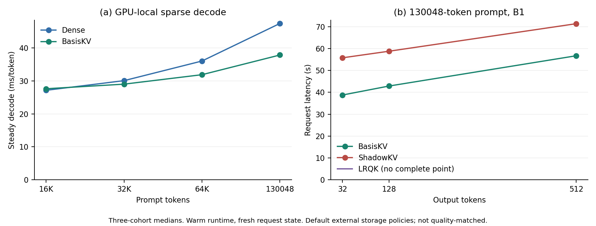
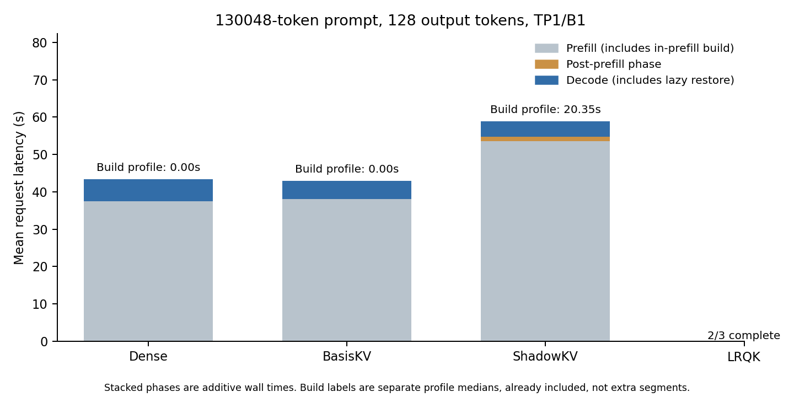

# TP1 Offline-Representation Benchmark

## Outcome

78 formal trials: **71 complete**, **7 GPU OOM**, 0 other failures.
Environment: `basis`, one NVIDIA L40S (GPU 0), serial TP1/B1, Llama-3.1-8B-Instruct, BF16, TF32 off.
All primary measurements follow same-shape runtime warmup and reset request-specific state.
BasisKV uses GPU-local K/V, Dense V128, the frozen 16-warp B16R16/Page32 full-scan path.
Neither the page-cache candidate nor two-stage routing is used.

Three fixed prompt cohorts use calibration windows 0/1/2. This is a timing study, not a held-out quality evaluation.
Tables report three-cohort medians only when all three trials complete. All raw failures remain recorded.

## GPU-Local Sparse Decode

Full-model values are CUDA-event steady medians: 16 conditioning calls, 128 measured calls, greedy feedback.
Attention-block values are separate 32-step component-profile means per cohort, then median across cohorts.
The block is after QKV/RoPE and before output projection, including cache update, routing, selection and attention.

| Prompt | Method | Full model ms/token | Attention block ms/token | Status |
|---:|---|---:|---:|---|
| 16384 | BasisKV | 27.597 | 4.401 | complete |
| 16384 | Dense | 27.124 | 3.814 | complete |
| 32768 | BasisKV | 28.988 | 5.840 | complete |
| 32768 | Dense | 30.050 | 6.705 | complete |
| 65536 | BasisKV | 31.853 | 8.694 | complete |
| 65536 | Dense | 35.994 | 12.583 | complete |
| 130048 | BasisKV | 37.817 | 14.649 | complete |
| 130048 | Dense | 47.370 | 23.857 | complete |

## Requests: 128 Output Tokens

Build is a separate synchronized profile of fitting plus required preparation/placement; nested timers are not added twice.
Ready delay is measured in the request path. LRQK restores per layer during the first decode, so its delay includes preceding decode work.
The steady tail is wall mean after the first 16 decode calls, including greedy selection; it is NOT the CUDA median above.

| Prompt | Method | Profiled build s | Ready delay s | Request s | Steady tail ms/token | Status |
|---:|---|---:|---:|---:|---:|---|
| 32768 | BasisKV | 0.000 | 0.000 | 8.306 | 28.822 | complete |
| 32768 | Dense | 0.000 | 0.000 | 8.433 | 29.924 | complete |
| 32768 | LRQK | 3.907 | 0.717 | 55.603 | 379.791 | complete |
| 32768 | ShadowKV | 11.671 | 0.579 | 19.131 | 29.252 | complete |
| 65536 | BasisKV | 0.000 | 0.000 | 16.399 | 31.607 | complete |
| 65536 | Dense | 0.000 | 0.000 | 16.709 | 35.869 | complete |
| 65536 | LRQK | 8.585 | 0.955 | 70.996 | 401.399 | complete |
| 65536 | ShadowKV | 14.699 | 0.963 | 29.508 | 30.814 | complete |
| 130048 | BasisKV | 0.000 | 0.000 | 42.898 | 37.522 | complete |
| 130048 | Dense | 0.000 | 0.000 | 43.418 | 47.179 | complete |
| 130048 | LRQK | - | - | - | - | 2/3 complete |
| 130048 | ShadowKV | 20.345 | 1.021 | 58.805 | 32.594 | complete |

## Output-Length Sweep

Prompt length is fixed at 130,048, leaving generation headroom.

| Output tokens | Method | Request s | Status |
|---:|---|---:|---|
| 32 | BasisKV | 38.769 | complete |
| 32 | LRQK | - | GPU OOM (3/3) |
| 32 | ShadowKV | 55.779 | complete |
| 128 | BasisKV | 42.898 | complete |
| 128 | LRQK | - | 2/3 complete |
| 128 | ShadowKV | 58.805 | complete |
| 512 | BasisKV | 56.723 | complete |
| 512 | LRQK | - | GPU OOM (3/3) |
| 512 | ShadowKV | 71.377 | complete |

## Interpretation and Limits

- BasisKV's zero prompt-specific fit does not mean free preparation: projection, encoding and cache writes are inside prefill.
- Model/factor loading, upfront cache allocation, input transfer, tokenization and network transport are excluded. This is warmed device-side request latency, not user-visible network latency.
- ShadowKV uses its default CPU V / rank-160 reconstructed K path; LRQK uses CPU exact K/V, rank 32, active 2048 plus lite 64. These are whole-runtime comparisons, not an offline-only ablation or quality-matched comparison.
- ShadowKV generation buffers are provisioned for actual initial support plus requested output length; selection and reconstruction are unchanged. LRQK retains exact tokenwise prefill MLP chunking at the long context; decode dispatch is unchanged.
- Fixed-length greedy generation ignores EOS. N outputs correspond to one prefill token and N-1 decode calls. Primary request validation checks final logits; separate smoke/steady checks cover additional intermediate logits.
- Construction profiles are separate instrumented passes. Do not subtract them from primary request time to invent exact build-free prefills or add them again to E2E.
- Each plotted stacked phase uses cohort means, so phases sum to mean E2E. Construction annotations are separate profile medians. Other tables and line plots use cohort medians.
- GPU OOM during warmup is still a failure of this requested runtime/configuration, not a timed latency or proof of an algorithmic capacity limit. Failure phases/log paths are in formal_outcomes.json.

- The LRQK environment emitted PyTorch graph-break and recompile-limit warnings during screening. Raw logs retain these warnings; results describe this adapted runtime, not an optimized performance bound for LRQK.

## Reproduction

Executed serially, directly under the user's authorization:

```bash
export CUDA_VISIBLE_DEVICES=0 CUDA_HOME=/usr/local/cuda MAX_JOBS=2 TORCH_CUDA_ARCH_LIST=8.9
/workspace/miniforge3/bin/conda run --no-capture-output -n basis \
  python benchmarks/system/run_tp1_offline_grid.py --phase formal \
  > results/system_benchmarks/tp1_offline/formal.log 2>&1
/workspace/miniforge3/bin/conda run --no-capture-output -n basis \
  python benchmarks/system/summarize_tp1_offline.py
```

The same launcher ran `--phase smoke` (6 trials) and `--phase capacity` (5 trials) before the formal grid.
Exact child commands, logs and results are retained per trial. Inputs are frozen in inputs/; source snapshots and dependencies are retained under formal/source/ and freeze/.
No SHA256 checks were performed.

## Archived Artifacts

Raw trial JSON, logs, prompts, frozen sources and factors are published in [the HF artifact directory](https://huggingface.co/alexz949/BasisServe-CALS/tree/main/system_benchmarks/tp1_offline).
The immutable raw-data revision shared with the GPU-local supplement is `86c03092c663dc6654584143130b5e5abf2fedaa`.
GitHub retains code, summaries, figures and small aggregate manifests; the raw payload is on HF.

From the repository root, retrieve the frozen raw-data revision:

```bash
hf download alexz949/BasisServe-CALS \
  --revision 86c03092c663dc6654584143130b5e5abf2fedaa \
  --include 'system_benchmarks/tp1_offline/*' 'system_benchmarks/tp1_lrqk_local/*' \
  --local-dir results
```

Restore `freeze/dependencies.tar.gz` into a separate staging directory, then inspect its repository-relative paths before copying them into a clean reproduction checkout. It includes the frozen TP1 harness and external source adaptations. The factors archive contains `ours_b16r16/`; the recorded benchmark expects it beneath `/workspace/runs/l31-router-source/v128-router/`.
Model weights are not bundled. Model/factor path constants, external build requirements and the `basis` environment must match the recorded runtime. Downloading artifacts alone does not install the runtime.
The frozen scripts contain original absolute paths in manifests; relocate those explicitly when reproducing on another machine.




